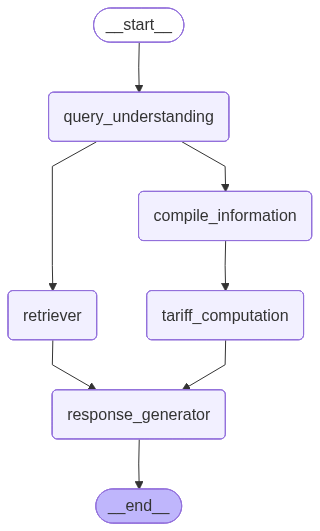

# Port Tariff Calculation System v0

A deterministic tariff calculation system for port charges, augmented with RAG (Retrieval-Augmented Generation) for context and explanations. This system uses LangGraph to orchestrate a multi-step workflow that extracts structured parameters from natural language queries, retrieves relevant context, performs deterministic calculations, and generates human-readable responses.

## Table of Contents

- [Overview](#overview)
- [Architecture](#architecture)
- [Project Structure](#project-structure)
- [Installation](#installation)
- [Usage](#usage)
- [Workflow](#workflow)
- [Components](#components)
- [Testing](#testing)
- [Key Design Decisions](#key-design-decisions)

## Prerequisites

**Before you begin, you must have:**
- An OpenAI API key (get one from [OpenAI Platform](https://platform.openai.com/api-keys))
- A `.env` file in the parent directory (`demo-marcura/.env`) with:
  ```env
  OPENAI_API_KEY=sk-your-actual-api-key-here
  ```

**The system will not work without a valid OpenAI API key.**

## Overview

This system provides a two-phase approach to port tariff calculations:

1. **Phase 1 (Extraction)**: One-time LLM-based extraction of tariff data from PDF documents, saved as structured JSON
2. **Phase 2 (Usage)**: Fast, deterministic calculations using the extracted JSON data, with RAG for context and explanations

### Key Features

- **Deterministic Calculations**: Tariff calculations are based on structured rules, not LLM inference
- **RAG Integration**: Vector database retrieval provides context for explanations
- **LangGraph Workflow**: Multi-step orchestration with parallel node execution
- **Natural Language Interface**: Users can query in plain English
- **Comprehensive Coverage**: Supports 12 vessel types and multiple tariff components

## Architecture

The system follows a clean architecture with clear separation of concerns:



### LangGraph-based Workflow Nodes

1. **Query Understanding**: Extracts structured parameters from natural language. Uses LLM.
2. **Retriever**: Retrieves relevant context from vector database
3. **Compile Information**: Validates and enriches parameters using JSON dataset  
4. **Tariff Computation**: Deterministic calculation using extracted rules
5. **Response Generator**: Combines calculation results and RAG context into natural language

## Project Structure

```
v0/
├── app.py                      # Gradio UI entry point
├── requirements.txt            # Python dependencies
├── setup.py                    # Package configuration
├── README.md                   # This file
│
├── scripts/                     # Utility scripts
│   └── extract_tariff_data.py  # One-time data extraction script
│
├── src/                        # Source code
│   ├── config/                 # Configuration and utilities
│   │   ├── settings.py         # Centralized configuration (Pydantic Settings)
│   │   ├── logging_config.py   # Logging setup and configuration
│   │   ├── messages.py         # User-facing message constants
│   │   └── env_loader.py       # Environment variable loading utility
│   │
│   ├── models/                 # Data models
│   │   ├── schema.py           # Tariff data models (VesselType, TariffRule, etc.)
│   │   ├── query_models.py     # Query input models (QueryParameters, VesselDetails, etc.)
│   │   └── utils.py            # Model utilities (condition evaluation, cost calculation)
│   │
│   ├── prompts/                # Prompt templates
│   │   ├── query_prompts.py    # Query understanding prompts
│   │   ├── response_prompts.py # Response generation prompts
│   │   └── extraction_prompts.py # Data extraction prompts
│   │
│   └── core/                   # Business logic
│       ├── query_understanding.py  # Query understanding class
│       ├── retriever.py        # Vector database retriever (RAG)
│       ├── dataset_loader.py   # Load tariff data from disk
│       ├── data_extractor.py   # Extract data from PDF (one-time)
│       ├── calculator.py       # Deterministic tariff calculator
│       ├── response_generator.py # Response generation
│       └── workflow.py         # LangGraph workflow orchestrator
│
├── data/                       # Source data
│   └── port-of-gothenburg-port-tariff-2025.pdf
│
├── extracted_data/             # Extracted structured data (gitignored)
│   └── tariff_rules.json
│
├── chroma_db/                  # Vector database (gitignored)
│   └── (ChromaDB files)
│
└── tests/                      # Test suite
    ├── conftest.py             # Pytest configuration and fixtures
    ├── test_fixtures.py        # Test fixtures
    ├── unit/                   # Unit tests
    │   ├── test_models_schema.py
    │   ├── test_models_utils.py
    │   ├── test_query_understanding.py
    │   ├── test_calculator.py
    │   ├── test_rag_retriever.py
    │   ├── test_response_generator.py
    │   └── test_extractor_loader.py
    └── integration/            # Integration tests
        └── test_workflow.py
```

## Installation

### Prerequisites

- Python 3.9+
- **OpenAI API key** (required for LLM calls)

### Setup

1. **Clone the repository** (if applicable) or navigate to the project directory:
   ```bash
   cd v0
   ```

2. **Create a virtual environment**:
   ```bash
   python -m venv venv
   source venv/bin/activate  # On Windows: venv\Scripts\activate
   ```

3. **Install dependencies**:
   ```bash
   pip install -r requirements.txt
   ```

4. ** IMPORTANT: Set up environment variables**
   
   **You must create a `.env` file with your OpenAI API key before running the system.**
   
   Create a `.env` file in the parent directory (`demo-marcura/.env`) with your OpenAI API key:
   ```env
   OPENAI_API_KEY=sk-your-actual-api-key-here
   ```
   
   **Note**: 
   - The `.env` file should be in the parent directory (`demo-marcura/.env`), not inside `v0/`
   - Replace `sk-your-actual-api-key-here` with your actual OpenAI API key
   - You can get an API key from [OpenAI Platform](https://platform.openai.com/api-keys)
   - The `.env` file is gitignored and will not be committed to the repository

5. **Extract tariff data** (one-time):
   ```bash
   python scripts/extract_tariff_data.py
   ```
   This will use an LLM to extract structured tariff rules from the PDF and save them to `extracted_data/tariff_rules.json`.
   
   **Note**: This step requires a valid `OPENAI_API_KEY` in your `.env` file. The extraction process makes LLM API calls to parse the PDF document.

## Usage

### Running the UI

**Make sure your `.env` file is set up with `OPENAI_API_KEY` before starting the UI.**

Start the Gradio interface:

```bash
python app.py
```

The UI will be available at `http://localhost:7860`.

**Note**: The UI uses OpenAI API for:
- Query understanding (extracting parameters from natural language)
- Response generation (creating human-readable answers)

Both features require a valid `OPENAI_API_KEY` in your `.env` file.

### Example Queries

- "A vessel at 14,000 GT arrives at the Port of Gothenburg from a port in Europe. The vessel has an ESI score of at least 30 points. Leaves 15 m³ (> 11 m³) sludge and receives a SEK 0.05 discount/GT on the waste fee when a valid certificate can be presented. Vessel type is Tanker. Calculate the total port tariff."

## Workflow

### Phase 1: Data Extraction (One-time)

The `scripts/extract_tariff_data.py` script:

1. Loads the PDF document
2. Uses an LLM (GPT-4) to extract structured tariff rules
3. Normalizes vessel types and component names
4. Saves to `extracted_data/tariff_rules.json`

**Note**: This phase is only run once. Subsequent runs use the extracted JSON data.

### Phase 2: Query Processing

When a user submits a query:

1. **Query Understanding**: LLM extracts structured parameters (vessel type, GT, arrival region, etc.)
2. **Parallel Execution**:
   - **Retriever**: Searches vector database for relevant context → goes directly to Response Generator
   - **Compile Information**: Validates parameters against JSON dataset → goes to Tariff Computation
3. **Tariff Computation**: Deterministic calculation using applicable rules → goes to Response Generator
4. **Response Generation**: LLM combines calculation results (from Tariff Computation) and RAG context (from Retriever) into a natural language response

## Components

### Data Models

- **`models/schema.py`**: Tariff data structure models
  - `VesselType`: Enumeration of vessel types
  - `TariffComponent`: Enumeration of tariff components
  - `TariffRule`: Complete tariff rule with bands, conditions, and pricing
  - `TariffDatabase`: Collection of all tariff rules

- **`models/query_models.py`**: Query input models
  - `QueryParameters`: Structured parameters extracted from user query
  - `VesselDetails`: Vessel specifications (GT, DWT, LOA, etc.)
  - `CallContext`: Call context (arrival region, calls per week, etc.)
  - `Quantities`: Quantities (sludge volume, solid waste, etc.)
  - `Environmental`: Environmental information (ESI score, certificates, etc.)

### Core Components

- **`query_understanding.py`**: Extracts structured parameters from natural language queries using LLM
- **`retriever.py`**: Retrieves relevant context from ChromaDB vector database
- **`dataset_loader.py`**: Fast loading of tariff data from JSON (no LLM calls)
- **`data_extractor.py`**: One-time extraction of tariff data from PDF using LLM
- **`calculator.py`**: Deterministic tariff calculator using extracted rules
- **`response_generator.py`**: Generates natural language responses from calculation results
- **`workflow.py`**: LangGraph orchestrator that coordinates all components

### Prompts

All prompt templates are organized in `src/prompts/`:
- `query_prompts.py`: Query understanding prompts
- `response_prompts.py`: Response generation prompts
- `extraction_prompts.py`: Data extraction prompts

## Testing

Run the test suite:

```bash
# Run all tests
pytest

# Run with coverage
pytest --cov=src --cov-report=html

# Run specific test file
pytest tests/unit/test_calculator.py
```

### Test Organization

- **`tests/unit/`**: Unit tests for individual components
- **`tests/integration/`**: Integration tests for the complete workflow

## Key Design Decisions

1. **Two-Phase Approach**: Separates expensive LLM extraction (one-time) from fast deterministic calculations (runtime)
2. **Deterministic Calculations**: Ensures consistent, reproducible results
3. **RAG for Context**: Provides explanations and additional context without affecting calculation accuracy
4. **LangGraph Orchestration**: Enables parallel execution and clear workflow definition
5. **Clean Architecture**: Separation of data models, business logic, and prompts
